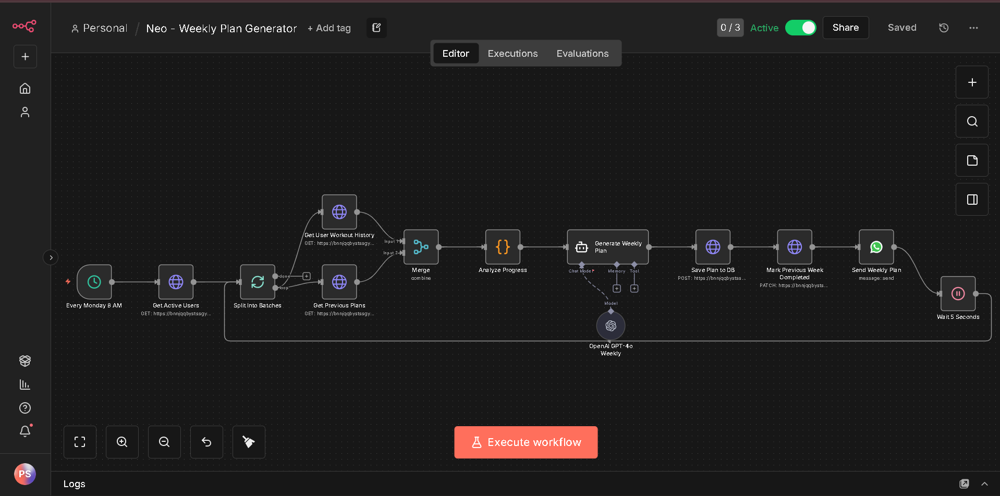
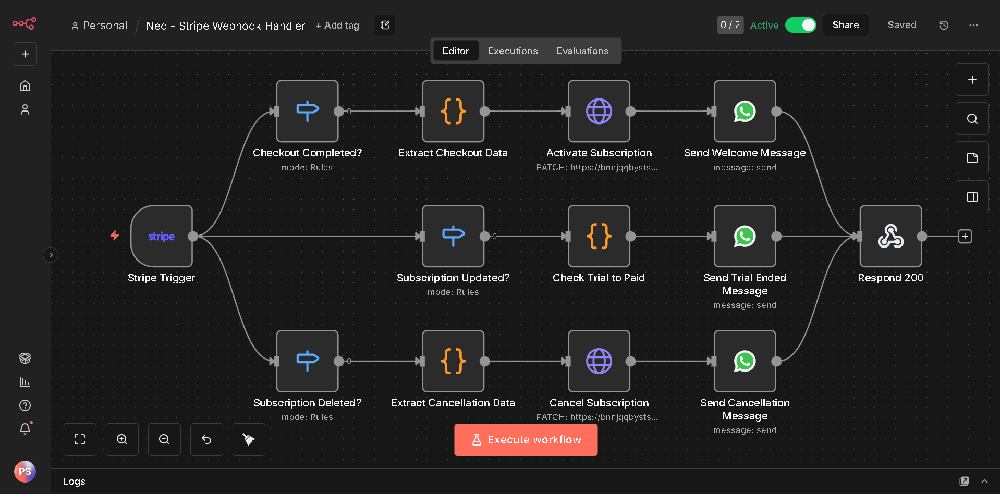
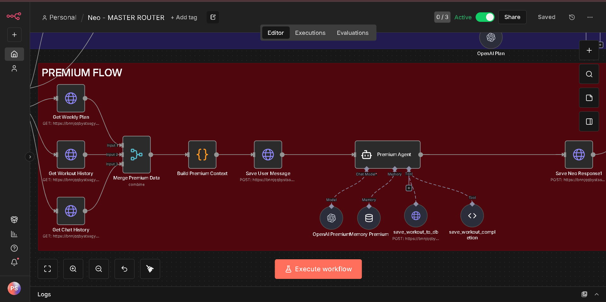

# 🏃‍♂️ Neo - AI-Powered WhatsApp Running Coach

> Full-stack subscription-based training platform delivering personalized coaching through WhatsApp using n8n, OpenAI GPT-4o, Stripe, and Supabase.


[](LICENSE)
[](https://n8n.io)
[](https://openai.com)
[](https://stripe.com)

## 📋 Table of Contents

- [Overview](#overview)
- [Features](#features)
- [Architecture](#architecture)
- [Tech Stack](#tech-stack)
- [Screenshots](#screenshots)
- [Key Challenges](#key-challenges)
- [Database Schema](#database-schema)
- [Business Model](#business-model)
- [Installation](#installation)
- [License](#license)
- [Contact](#contact)

## 🎯 Overview

Neo transforms professional running coaching into an accessible WhatsApp experience. Traditional coaches cost €100-300/month and require constant availability. Neo provides 24/7 AI-powered coaching at €9.99/month through automated subscription management and personalized training plans.

**Problem:** Running coaches are expensive and inaccessible.  
**Solution:** AI-powered WhatsApp bot with automated plan generation, progress tracking, and subscription billing.  
**Result:** Scalable coaching platform handling unlimited users with zero manual intervention.

## ✨ Features

### 🤖 Conversational Onboarding
- Natural language data collection via WhatsApp
- User profiling (age, weight, running level, goals, availability)
- Instant personalized plan generation


### 💳 Subscription Management
- Three pricing tiers (€9.99/month, €55/6-months, €100/year)
- Stripe Checkout integration
- Discount code system
- Automated subscription lifecycle via webhooks


### 📅 Automated Weekly Plans
- Every Monday at 8 AM generation
- Progress-based adaptation (completion rate + difficulty analysis)
- Personalized sessions with distance, pace, and nutrition tips


### 🏋️ Workout Tracking
- Session logging (distance, time, pace, difficulty)
- AI-powered tool for data extraction
- Performance history and analytics


### ⏰ Daily Reminders
- Smart scheduling based on weekly plan
- Completion verification
- Motivational messaging

### 💾 Persistent Memory
- 100-message chat history
- Weekly plan storage
- Workout history tracking
- Context-aware responses across sessions

## 🏗️ Architecture

Neo consists of **6 interconnected n8n workflows**:

### 1. Master Router
Intelligent message routing with 3 paths:
- **Onboarding Route**: New user data collection
- **Payment Route**: Stripe checkout flow
- **Premium Route**: Active subscriber interactions


### 2. Weekly Plan Generator
Automated Monday morning execution:
- Fetches active users
- Analyzes previous week performance
- Generates personalized plans via GPT-4o
- Saves to database and sends via WhatsApp



### 3. Workout Reminders
Daily 9 PM check-in:
- Identifies users with scheduled workouts
- Checks completion status
- Sends motivational reminders


### 4. Stripe Webhook Handler
Subscription lifecycle automation:
- Subscription created/updated/canceled events
- Database status synchronization
- Welcome/cancellation messaging



### 5. Premium Agent
AI-powered coaching with custom tools:
- GPT-4o integration
- Workout completion tool
- Chat history persistence
- Context-aware responses



### 6. Database Operations
Persistent storage layer:
- User profiles
- Chat history (100 messages)
- Weekly plans
- Workout tracking

## 🛠️ Tech Stack

| Category | Technology |
|----------|-----------|
| **Workflow Automation** | n8n |
| **Messaging** | WhatsApp Business API |
| **AI/ML** | OpenAI |
| **Database** | Supabase (PostgreSQL) |
| **Payments** | Stripe |
| **Architecture** | Webhook-based, Event-driven |

## 📸 Screenshots

### User Experience

<table>
  <tr>
    <td width="50%">
      
      <p align="center"><b>Conversational Onboarding</b></p>
    </td>
    <td width="50%">
      
      <p align="center"><b>Personalized Weekly Plan</b></p>
    </td>
  </tr>
  <tr>
    <td width="50%">
      
      <p align="center"><b>Stripe Subscription Checkout</b></p>
    </td>
    <td width="50%">
      
      <p align="center"><b>AI Workout Tracking</b></p>
    </td>
  </tr>
</table>

### Backend Architecture

<table>
  <tr>
    <td width="50%">
      
      <p align="center"><b>Master Router Workflow</b></p>
    </td>
    <td width="50%">
      
      <p align="center"><b>Supabase Database Tables</b></p>
    </td>
  </tr>
</table>

## 🔧 Key Challenges & Solutions

### Challenge 1: Webhook Routing Conflicts
**Problem:** Multiple WhatsApp triggers caused duplicate message handling.

**Solution:** Implemented master router pattern with intelligent 3-route architecture, consolidating all WhatsApp webhooks into a single entry point.

**Impact:** Eliminated duplicate executions, improved reliability.

---

### Challenge 2: Data Persistence
**Problem:** WhatsApp conversation memory expired after 24 hours, losing user context.

**Solution:** Built database-backed persistence layer storing chat history, user profiles, and workout data.

**Impact:** Seamless conversations with full context across sessions.

---

### Challenge 3: Stripe Integration
**Problem:** Checkout sessions failing due to Product ID vs Price ID confusion.

**Solution:** Corrected implementation to use Stripe Price IDs with proper metadata tracking.

**Impact:** 100% successful checkout conversion.

---

### Challenge 4: AI Plan Quality
**Problem:** Generic plans without progression logic.

**Solution:** Created progression engine analyzing completion rate (0-100%), difficulty ratings (1-10), and workout history to adapt intensity.

**Logic:**
- High difficulty (8+) → Reduce intensity 10-15%
- Low difficulty (≤3) + 80% completion → Increase load 5-10%
- Low completion (<50%) → Maintain intensity, increase motivation

**Impact:** Truly personalized, adaptive training plans.

---

### Challenge 5: Double Execution
**Problem:** Multiple GET nodes connected to single analysis node caused duplicate executions.

**Solution:** Added Merge nodes with "Merge By Position" mode.

**Impact:** Prevented duplicate plan generation and database writes.

## 💾 Database Schema
```sql
-- Users Table
CREATE TABLE users (
phone TEXT PRIMARY KEY,
nom TEXT,
edat INTEGER,
pes DECIMAL,
sexe TEXT,
terreny TEXT,
dies_disponibles INTEGER,
disponibilitat_detallada TEXT,
nivell TEXT,
objectius TEXT,
subscripcio TEXT CHECK (subscripcio IN ('active', 'trial', 'canceled')),
stripe_customer_id TEXT,
onboarding_completed BOOLEAN DEFAULT false,
created_at TIMESTAMPTZ DEFAULT NOW()
);-- Chat History Table
CREATE TABLE chat_history (
id UUID PRIMARY KEY DEFAULT gen_random_uuid(),
user_phone TEXT REFERENCES users(phone),
role TEXT CHECK (role IN ('user', 'assistant')),
message TEXT,
created_at TIMESTAMPTZ DEFAULT NOW()
);-- Weekly Plans Table
CREATE TABLE weekly_plans (
id UUID PRIMARY KEY DEFAULT gen_random_uuid(),
user_phone TEXT REFERENCES users(phone),
week_number INTEGER,
plan_text TEXT,
status TEXT CHECK (status IN ('active', 'completed')),
created_at TIMESTAMPTZ DEFAULT NOW(),
UNIQUE(user_phone, week_number)
);-- Workout History Table
CREATE TABLE workout_history (
id UUID PRIMARY KEY DEFAULT gen_random_uuid(),
user_phone TEXT REFERENCES users(phone),
week_number INTEGER,
session_number INTEGER,
distance DECIMAL(5,2),
time_minutes DECIMAL(6,2),
pace_min_per_km DECIMAL(5,2),
difficulty_rating INTEGER CHECK (difficulty_rating BETWEEN 1 AND 10),
feedback TEXT,
completed BOOLEAN DEFAULT true,
completion_date TIMESTAMPTZ,
created_at TIMESTAMPTZ DEFAULT NOW(),
UNIQUE(user_phone, week_number, session_number)
);


## 💰 Business Model

| Tier | Price | Discount | Features |
|------|-------|----------|----------|
| Monthly | €9.99/mo | - | Pay as you go |
| 6-Month | €55 | 8% | Best value for commitment |
| Annual | €100 | 16% | Maximum savings |

**Free Trial:** 7-day trial period on all plans

**Discount Codes:** Support for promotional codes

## 📦 Installation

> **Note:** This is a portfolio project. The workflows are provided for educational purposes. Running this system requires:
> - n8n instance
> - WhatsApp Business API account
> - OpenAI API key
> - Stripe account
> - Supabase database

### Prerequisites

n8n (self-hosted or cloud)
WhatsApp Business API credentials
OpenAI API key
Stripe API keys (test + live)
Supabase account 


### Quick Start

1. **Clone Repository**
git clone https://github.com/[your-username]/neo-ai-running-coach.git
cd neo-ai-running-coach

2. **Import Workflows**
- Import JSON files from `/workflows` directory into n8n
- Update credentials for all integrations

3. **Setup Database**
Run schema.sql in Supabase SQL Editor

4. **Configure Webhooks**
- Set WhatsApp webhook to Master Router URL
- Set Stripe webhook to Webhook Handler URL

5. **Update Environment Variables**
- Add API keys to n8n credentials
- Update phone numbers and Stripe Price IDs

See [SETUP.md](docs/SETUP.md) for detailed instructions.

## 📊 Metrics📈 System Scale:

6 production workflows
4 API integrations
4 database tables
100-message chat memory
Unlimited concurrent users
Sub-second response times


## 🚀 Future Enhancements

- [ ] Mobile app integration
- [ ] Heart rate zone monitoring
- [ ] Race preparation programs
- [ ] Nutrition tracking
- [ ] Community features
- [ ] Multi-language support

## 📄 License

This project is licensed under the MIT License - see the [LICENSE](LICENSE) file for details.

## 📧 Contact

**Built by:** Taiye Promise Kotiku

**Portfolio:** [https://taiye.framer.website]  
**LinkedIn:** [Your LinkedIn]  
**Email:** [promisetaiye16@gmail.com]  
**Twitter:** [@taiyekotiku]

---

<p align="center">
  <b>Interested in building something similar?</b><br>
  I'm available for freelance AI automation projects!<br>
  <a href="mailto:promisetaiye16@gmail.com">Let's talk →</a>
</p>

---

<p align="center">
  ⭐ If you found this project interesting, please star it!
</p>